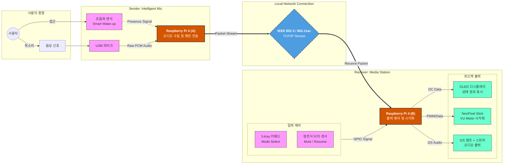
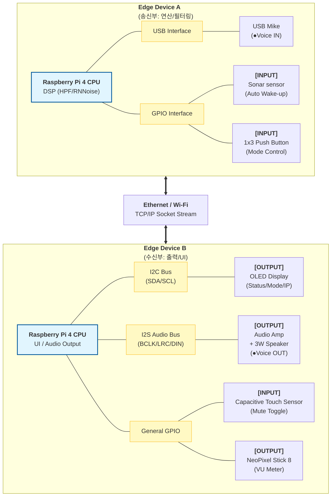
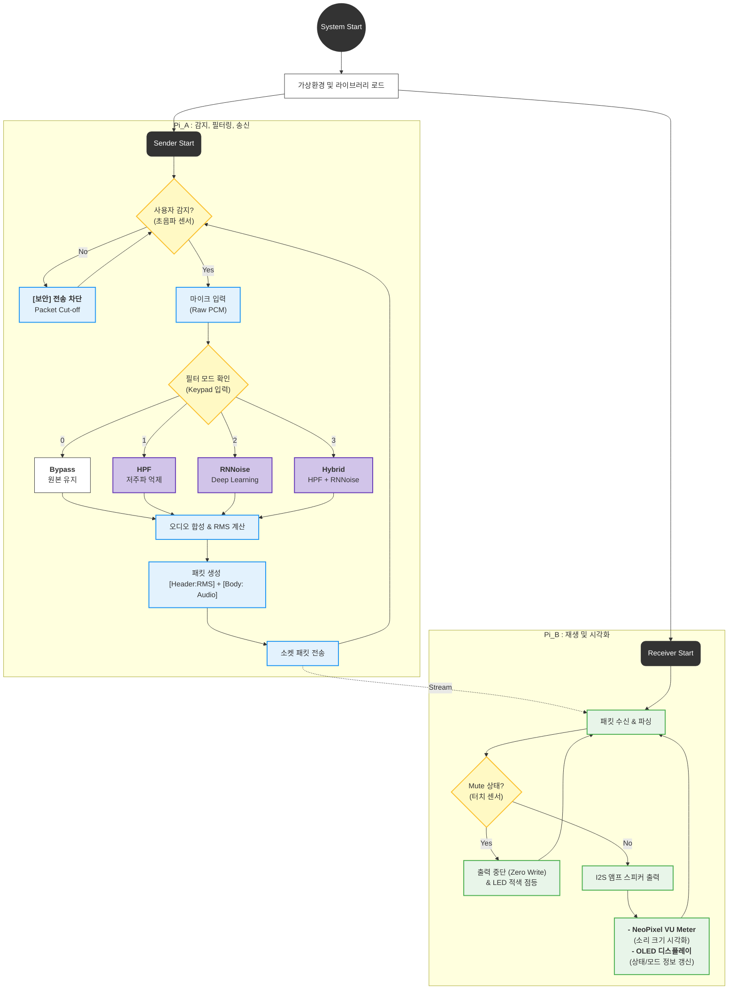

# **2025-2 Embedded System Design Project** 
> **Team:** Noise_Filter_Team(Silentium Factorem)

> **Period:** 2025.11.26 ~ 2025.12.22

---
## 🔊 Distributed Real-Time Voice Noise Filtering System (실시간 음성 노이즈 제거 임베디드 시스템)

---

## 👥 팀원 및 역할 분담 (Roles & Responsibilities)
> **팀원:** 정상진, 신정수 

프로젝트 수행을 위해 필요한 세부 직무 리스트입니다.

| 구분 | 상세 직무 (Tasks) | 담당자 |
| :--- | :--- | :---: |
| **System Arch.** | 전체 시스템 구조 설계 및 네트워크 토폴로지 정의 | `[ 정상진 ]` |
| **Network** | TCP/IP 소켓 통신 구현 (Latency 최적화, 패킷 구조 설계) | `[ 정상진 ]` |
| **DSP / AI** | 오디오 신호 처리 (RMS 계산, HPF 알고리즘, RNNoise 적용) | `[ 팀 전체 ]` |
| **Embedded SW** | 송신부(Pi A) 센서 제어 로직 (초음파, 키패드 연동) | `[ 정상진 ]` |
| **Embedded SW** | 수신부(Pi B) 출력 제어 로직 (OLED, NeoPixel, I2S 앰프) | `[ 신정수 ]` |
| **Hardware** | 회로 설계, 브레드보드 배선, 납땜 및 케이블링 | `[ 신정수 ]` |
| **Mechanical** | 기구 하우징(Case) 3D 모델링 및 제작 | `[ 신정수 ]` |
| **Documentation** | 제안서, 최종 보고서 작성, 발표 자료(PPT) 및 데모 영상 제작 | `[ 신정수 ]` |

---

## 📖 프로젝트 개요 (Overview)

**Edge Live Stream Filter System**은 두 대의 Raspberry Pi 4를 활용한 **분산형 실시간 오디오 처리 시스템**입니다.

기존 PC 기반 노이즈 캔슬링 소프트웨어의 리소스 점유 문제와 보안 취약점을 해결하기 위해 고안되었습니다. 모든 오디오 수집, 전송, 필터링 연산을 **엣지 디바이스(Edge Device)**에서 독립적으로 수행함으로써 사용자 PC의 부하를 **'Zero'**로 유지하며, 물리적 센서(초음파)와 연동하여 사용자가 없을 때는 **네트워크 패킷 전송을 원천 차단(Packet Cut-off)**하여 물리적 보안성을 확보합니다.

### 🎯 주요 기능 (Key Features)

* **📡 초저지연 네트워크 스트리밍 (Low-latency Streaming)**
    * TCP/IP 소켓 통신 최적화(Nagle 알고리즘 해제)를 통해 실시간 음성 전송 보장.
    * 직접 연결(Direct LAN) 및 Wi-Fi 환경 모두 지원.
* **🎛️ DSP 기반 노이즈 필터링 (Multi-Mode DSP)**
    * **Mode 0 (RAW):** 원본 오디오 바이패스.
    * **Mode 1 (HPF):** 저주파 및 진동 소음 제거 (High Pass Filter).
    * **Mode 2 (RNNoise):** 딥러닝 기반 사람 목소리 분리 및 잡음 제거.
    * **Mode 3 (Hybrid):** HPF + RNNoise 직렬 적용.
* **📊 실시간 시각화 (Real-time VU Meter)**
    * 오디오 신호의 RMS(에너지)를 계산하여 NeoPixel LED Bar로 실시간 시각화.
    * OLED 디스플레이를 통해 IP 주소, 필터 모드, 네트워크 상태 모니터링.
* **🛡️ 물리적 보안 및 능동 제어 (Physical Security & Control)**
    * **Smart Wake-up:** 초음파 센서로 사용자 재실 감지 시에만 시스템 작동.
    * **Packet Cut-off:** 사용자 부재 또는 Mute 시 네트워크 전송 로직 차단.
    * **Emergency Mute:** 정전식 터치 센서를 통한 즉각적인 음소거 및 상태 표시.

---

## 🏗️ 시스템 아키텍처 (Architecture)

### 1. 시스템 개념도 (Concept)
사용자의 음성을 수집(Pi A)하여 필터링 후 전송하고, 수신측(Pi B)에서 재생 및 시각화하는 전체 흐름입니다.

### 2. 하드웨어 블록도 (Hardware Block Diagram)
각 라즈베리파이에 연결된 센서 및 액추에이터의 인터페이스 상세입니다.

### 3. 시스템 플로우차트 (Software Flowchart)
데이터 처리 및 제어 로직의 흐름입니다.

## 🛠 기술 스택 (Tech Stack)

| 분류 | 상세 기술 | 비고 |
| :--- | :--- | :--- |
| **Hardware** | **Raspberry Pi 4 Model B (4GB)** | Main Controller (x2) |
| | **MAX98357A (I2S Amp)** | High Quality Audio Output |
| | **HC-SR04** / **TTP223** | Ultrasonic / Touch Sensor |
| | **SSD1306 (OLED)** / **WS2812B** | Display / NeoPixel LED |
| **Language** | **Python 3.9+** | Main Development Language |
| **Network** | **TCP/IP Socket** | `socket`, `struct` (Low-latency) |
| **Audio/DSP** | **NumPy**, **PyAudio**, **RNNoise** | Signal Processing & AI Filter |
| **Library** | `adafruit-circuitpython-ssd1306` | OLED Control |
| | `rpi_ws281x` | NeoPixel Control |
| | `RPi.GPIO` | General Sensor Control |
