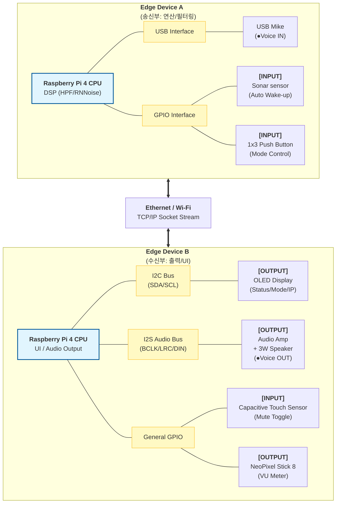

# Hardware
---
## Block Diagram

```mermaid
graph TD
    %% 스타일 정의
    classDef cpu fill:#e1f5fe,stroke:#01579b,stroke-width:2px;
    classDef bus fill:#fff9c4,stroke:#fbc02d,stroke-width:1px;

    subgraph Sender_Unit ["<b>Edge Device A</b> <br>(송신부: 연산/필터링)"]
        CPU_A["<b>Raspberry Pi 4 CPU</b><br>DSP (HPF/RNNoise)"]:::cpu
        
        USB_Port[USB Interface]:::bus
        GPIO_A[GPIO Interface]:::bus
        
        Mic_HW["USB Mike <br>(●Voice IN)"]
        SR04_A["<b>[INPUT]</b> <br>Sonar sensor<br>(Auto Wake-up)"]
        Keypad_HW["<b>[INPUT]</b> <br>1x3 Push Button<br>(Mode Control)"]

        
        CPU_A --- USB_Port
        CPU_A --- GPIO_A
        
        USB_Port --- Mic_HW
        GPIO_A --- SR04_A
        GPIO_A --- Keypad_HW
    end

    Link["<b>Ethernet / Wi-Fi</b><br>TCP/IP Socket Stream"]

    subgraph Receiver_Unit ["<b>Edge Device B</b> <br>(수신부: 출력/UI)"]
        CPU_B["<b>Raspberry Pi 4 CPU</b><br>UI / Audio Output"]:::cpu
        
        I2C_Bus["I2C Bus<br>(SDA/SCL)"]:::bus
        I2S_Bus["I2S Audio Bus<br>(BCLK/LRC/DIN)"]:::bus
        GPIO_B[General GPIO]:::bus
        
        OLED_HW["<b>[OUTPUT]</b> <br>OLED Display <br>(Status/Mode/IP)"]
        Amp_HW["<b>[OUTPUT]</b> <br> Audio Amp <br>+ 3W Speaker <br>(●Voice OUT)"]
        
        Touch_HW["<b>[INPUT]</b> <br>Capacitive Touch Sensor<br>(Mute Toggle)"]
        Neo_HW["<b>[OUTPUT]</b> <br>NeoPixel Stick 8 <br>(VU Meter)"]
        
        CPU_B --- I2C_Bus
        CPU_B --- I2S_Bus
        CPU_B --- GPIO_B
        
        I2C_Bus --- OLED_HW
        I2S_Bus --- Amp_HW
        
        GPIO_B --- Touch_HW
        GPIO_B --- Neo_HW
    end

    Sender_Unit <==> Link <==> Receiver_Unit
```