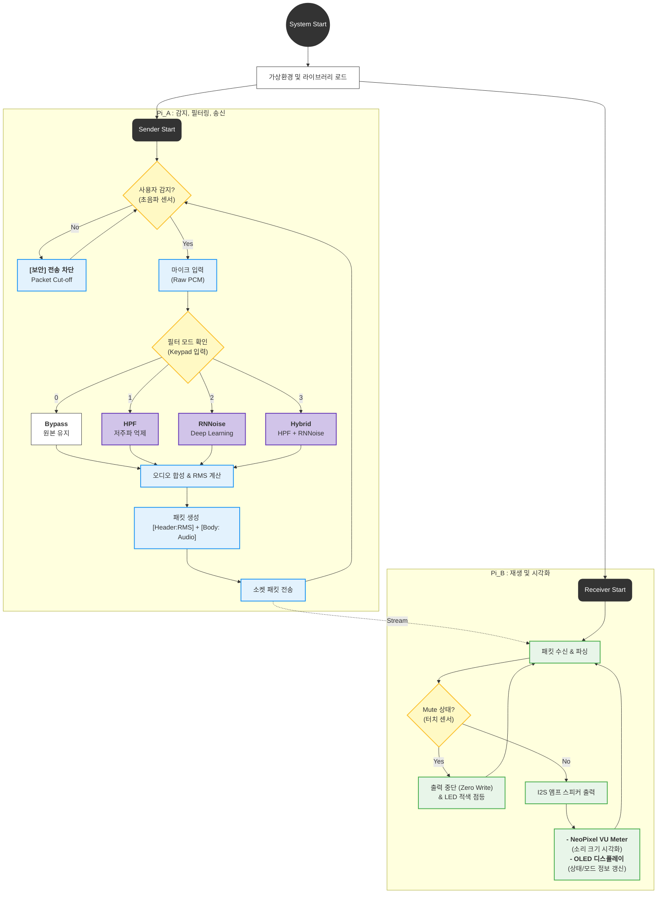

# Software
---
## Main Flowchart

```mermaid
flowchart TD
    %% --- 스타일 정의 ---
    classDef start fill:#333,stroke:#333,stroke-width:2px,color:white,rx:10,ry:10;
    classDef proc fill:#fff,stroke:#333,stroke-width:1px;
    classDef decision fill:#fff9c4,stroke:#fbc02d,stroke-width:2px;
    classDef sender fill:#e3f2fd,stroke:#2196f3,stroke-width:2px;
    classDef receiver fill:#e8f5e9,stroke:#4caf50,stroke-width:2px;
    classDef filter fill:#d1c4e9,stroke:#673ab7,stroke-width:2px;

    %% --- 시작점 ---
    Root((System Start)):::start --> Init["가상환경 및 라이브러리 로드"]:::proc
    Init --> Fork_A
    Init --> Fork_B

    %% --- [Pi A] 송신부 ---
    subgraph Sender_Logic [Pi_A : 감지, 필터링, 송신]
        direction TB
        Fork_A(Sender Start):::start
        
        Fork_A --> Check_User{"사용자 감지?<br>(초음파 센서)"}:::decision
        
        %% 분기: 사용자 없음
        Check_User -- No --> Packet_Cut["<b>[보안] 전송 차단</b><br>Packet Cut-off"]:::sender
        Packet_Cut --> Check_User
        
        %% 분기: 사용자 있음
        Check_User -- Yes --> Read_Mic["마이크 입력<br>(Raw PCM)"]:::sender
        Read_Mic --> Check_Mode{"필터 모드 확인<br>(Keypad 입력)"}:::decision
        
        %% 필터 모드 분기 (자연스러운 배치)
        Check_Mode -- 0 --> Filter_Raw["<b>Bypass</b><br>원본 유지"]:::proc
        Check_Mode -- 1 --> Filter_HPF["<b>HPF</b><br>저주파 억제"]:::filter
        Check_Mode -- 2 --> Filter_RNN["<b>RNNoise</b><br>Deep Learning"]:::filter
        Check_Mode -- 3 --> Filter_Both["<b>Hybrid</b><br>HPF + RNNoise"]:::filter
        
        %% 필터 합류
        Filter_Raw --> Process_Data["오디오 합성 & RMS 계산"]:::sender
        Filter_HPF --> Process_Data
        Filter_RNN --> Process_Data
        Filter_Both --> Process_Data
        
        Process_Data --> Make_Pkt["패킷 생성 <br>[Header:RMS] + [Body: Audio]"]:::sender
        Make_Pkt --> Send_Pkt["소켓 패킷 전송"]:::sender
        
        %% 루프백
        Send_Pkt --> Check_User
    end

    %% --- 네트워크 연결 ---
    Send_Pkt -.->|Stream| Recv_Pkt

    %% --- [Pi B] 수신부 ---
    subgraph Receiver_Logic [Pi_B : 재생 및 시각화]
        direction TB
        Fork_B(Receiver Start):::start
        
        Fork_B --> Recv_Pkt["패킷 수신 & 파싱"]:::receiver
        Recv_Pkt --> Check_Mute{"Mute 상태?<br>(터치 센서)"}:::decision
        
        %% Mute 분기
        Check_Mute -- Yes --> Stop_Sound["출력 중단 (Zero Write)<br>& LED 적색 점등"]:::receiver
        Stop_Sound --> Recv_Pkt
        
        %% 정상 출력 분기
        Check_Mute -- No --> Output_Spk["I2S 앰프 스피커 출력"]:::receiver
        Output_Spk --> Update_Visual["<b>- NeoPixel VU Meter</b> <br>(소리 크기 시각화)<br><b>- OLED 디스플레이</b> <br>(상태/모드 정보 갱신)"]:::receiver
        
        Update_Visual --> Recv_Pkt
    end

```