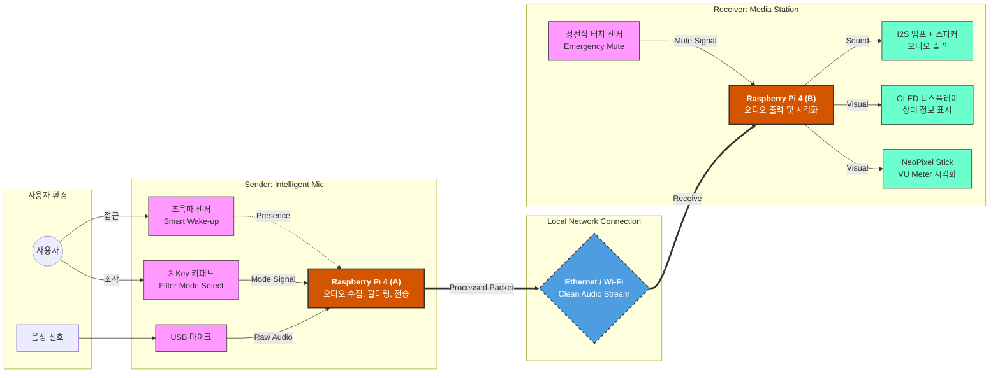

# System
---
## Concept Diagram

```mermaid　
---
config:
  layout: fixed
---
flowchart LR
 subgraph User_Side["사용자 환경"]
        User(("사용자"))
        Sound_Source["음성 신호"]
  end
 subgraph Edge_Device_A["Sender: Intelligent Mic"]
        Pi_A["<b>Raspberry Pi 4 (A)</b><br>오디오 수집, 필터링, 전송"]
        Mic["USB 마이크"]
        Ultra_A["초음파 센서<br>Smart Wake-up"]
        Keypad["3-Key 키패드<br>Filter Mode Select"]
  end
 subgraph Network_Layer["Local Network Connection"]
        Ethernet{"<b>Ethernet / Wi-Fi</b><br>Clean Audio Stream"}
  end
 subgraph Edge_Device_B["Receiver: Media Station"]
        Pi_B["<b>Raspberry Pi 4 (B)</b><br>오디오 출력 및 시각화"]
        Touch["정전식 터치 센서<br>Emergency Mute"]
        OLED["OLED 디스플레이<br>상태 정보 표시"]
        NeoPixel["NeoPixel Stick<br>VU Meter 시각화"]
        Amp["I2S 앰프 + 스피커<br>오디오 출력"]
  end
    User -- 접근 --> Ultra_A
    User -- 조작 --> Keypad
    Sound_Source --> Mic
    Ultra_A -. Presence .-> Pi_A
    Mic -- Raw Audio --> Pi_A
    Keypad -- Mode Signal --> Pi_A
    Pi_A == Processed Packet ==> Ethernet
    Ethernet == Receive ==> Pi_B
    Touch -- Mute Signal --> Pi_B
    Pi_B -- Sound --> Amp
    Pi_B -- Visual --> OLED & NeoPixel

     Pi_A:::pi
     Mic:::sensor
     Ultra_A:::sensor
     Keypad:::sensor
     Ethernet:::network
     Pi_B:::pi
     Touch:::sensor
     OLED:::output
     NeoPixel:::output
     Amp:::output
    classDef pi fill:#d45500,stroke:#333,stroke-width:2px,color:white
    classDef sensor fill:#f9f,stroke:#333,stroke-width:1px
    classDef output fill:#6affcd,stroke:#333,stroke-width:1px
    classDef network fill:#4d9de0,stroke:#333,stroke-width:2px,color:white,stroke-dasharray: 5 5

```